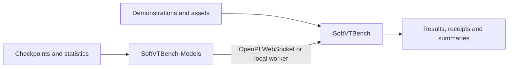

# Architecture

SoftVTBench is split across two repositories: a benchmark repository defines the
world and scoring contract, while a model repository defines training and policy
serving. Datasets and checkpoints are external artifacts rather than Git history.

## Ownership

| Concern | SoftVTBench | SoftVTBench-Models |
|---|:---:|:---:|
| Suites, objects and OOD conditions | owner | - |
| Isaac Lab environment and simulator assets | owner | - |
| Observation/action protocol | owner | consumer |
| Rotation and deterministic seed utilities | owner | consumer |
| Rollout, success and deformation metrics | owner | - |
| π0.5, ACT, DP and FastWAM source | - | owner |
| Training configs and checkpoint registry | - | owner |
| Backend-specific serving processes | client | owner |

The policy registry is deliberately split by concern. Models declare loader and
checkpoint fields in `SoftVTBench-Models/configs/policies.yaml`. The benchmark
declares execution profiles in `config/policy_protocols.yaml`. At runtime
`softvtbench.config.load_policy_manifest` rejects overlapping fields and merges
the two documents into the evaluator's resolved policy definition.

## Runtime boundary

OpenPI runs as a WebSocket server. ACT, Diffusion Policy and FastWAM run behind
the same localhost HTTP/pickle worker protocol. The worker boundary is local and
trusted; it is not a network service or security boundary. Its purpose is to
isolate incompatible CUDA/Python dependency stacks while keeping one benchmark
client and one rollout implementation.

Every policy implements four operations: `reset`, `set_language`, `observe` and
`predict`. Model adapters may assemble model-specific observations, but shared
image naming, 7-D proprioception, quaternion branch tracking and episode seed
derivation are imported from SoftVTBench.

## Design constraints

- No model backend is vendored in the benchmark.
- No metric, rollout or simulator module is vendored in the models repository.
- Formal configurations are data, not conditionals spread across scripts.
- Machine-specific locations are environment variables, not source edits.
- Generated data, checkpoints, caches and results stay outside Git.
- Abstractions are introduced only where at least two concrete consumers share
  a stable contract.

