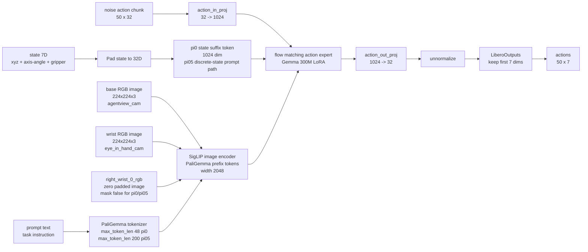
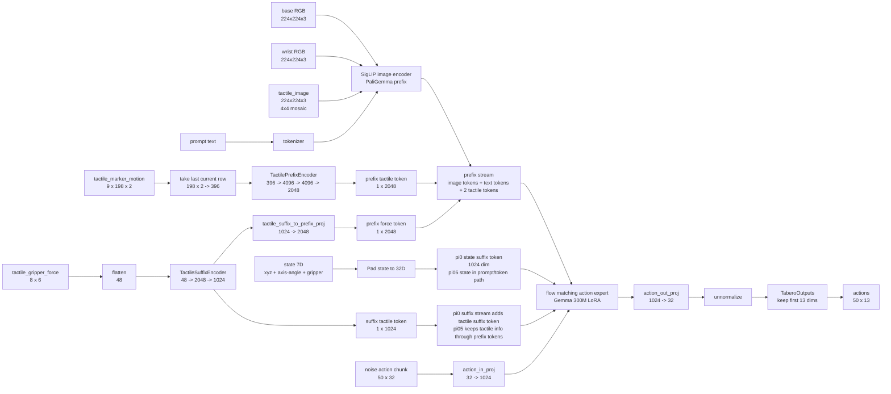

# Tabero OpenPI Simulator 评测流程与网络结构

本文档记录在 simulator 机器上评测 Tabero OpenPI policy 的固定流程。训练在本机 `/data/mingxinwang/openpi-univtac` 完成；评测在 simulator 的 Tabero/Isaac Sim 环境里执行。

## 0. 当前结论

- simulator1/2/3 可以连通，且共享 `/vepfs-C区/visuotactile/openpi` 和 `/vepfs-C区/visuotactile/Tabero`；simulator4/5 最近 SSH 超时。
- 推荐优先用 simulator3：`ssh -p 44998 root@124.174.13.117`。
- simulator OpenPI 代码已和本机 `/data/mingxinwang/openpi-univtac` 的 Tabero 关键代码对齐；正式 config 已可 import 和 serve。
- OpenPI server 使用 `/vepfs-C区/visuotactile/openpi/.venv/bin/python`，不要用 conda `tabero` 环境起 server。
- Tabero/Isaac client 使用 conda `tabero` 环境。
- 预测步数统一是 `action_horizon=50`；评测端每次 server inference 只执行前 `replan_steps=10` 步。
- `max_inference_steps=30` 是每个 episode 最多重规划 30 次，不是 flow-matching 去噪步数；一个 episode 最多执行 `30 * 10 = 300` 个 env step。
- 单任务 quick eval 建议 `num_total_experiments=10`；早停可设 `TABERO_MAX_CONSECUTIVE_FAILURES=10`。

## 1. 机器和路径

SSH：

```bash
ssh -p 44998 root@124.174.13.117   # simulator3，推荐
ssh -p 18186 root@124.174.13.117   # simulator
ssh -p 62468 root@124.174.13.117   # simulator2
ssh -p 58581 root@124.174.13.117   # simulator4，最近超时
ssh -p 50288 root@124.174.13.117   # simulator5，最近超时
```

simulator 侧固定路径：

```bash
TABERO_DIR=/vepfs-C区/visuotactile/Tabero
OPENPI_DIR=/vepfs-C区/visuotactile/openpi
DATA_DIR=/vepfs-C区/visuotactile/datasets/Isaaclab_Libero
CONDA_SH=/vepfs-C区/visuotactile/miniconda3/etc/profile.d/conda.sh
```

官方 Tabero tactile pi0 ckpt：

```bash
OFFICIAL_TABERO_CKPT=/vepfs-C区/visuotactile/checkpoints/pi0_lora_tacall_tabero_enc/checkpoints/pi0_lora_tacall_tabero/pi0_lora_tacall_tabero_new/49999
```

我自己训练出来的 ckpt 建议放到：

```bash
/vepfs-C区/visuotactile/checkpoints/openpi_runs/<config>/<exp>/<step>
```

从本机迁移 ckpt 到 simulator 示例：

```bash
LOCAL_CKPT=/data/mingxinwang/openpi-univtac/checkpoints/pi0_lora_tacall_tabero/<EXP>/30000
REMOTE_CKPT=/vepfs-C区/visuotactile/checkpoints/openpi_runs/pi0_lora_tacall_tabero/<EXP>/30000

rsync -avP -e 'ssh -p 44998' "${LOCAL_CKPT}/" \
  root@124.174.13.117:"${REMOTE_CKPT}/"
```

## 2. 可评测的 config 和动作接口

| policy | OpenPI config | ckpt 来源 | 输入 | server 输出 | client 执行动作 |
|---|---|---|---|---|---|
| pi0 纯视觉 | `pi0_lora_vision_tabero` | 本机训练 ckpt | base RGB + wrist RGB + state + prompt | `[50, 7]` | `--control_mode tactile --abs7d` 时补 0 成 13D 给 tactile env |
| pi05 纯视觉 | `pi05_lora_vision_tabero` | 本机训练 ckpt | base RGB + wrist RGB + state + prompt | `[50, 7]` | 同上 |
| pi0 视觉+触觉 | `pi0_lora_tacall_tabero` | 官方 ckpt 或本机训练 ckpt | base RGB + wrist RGB + tactile mosaic + force + marker + state + prompt | `[50, 13]` | tactile env 原生 13D |
| pi05 视觉+触觉 | `pi05_lora_tacall_tabero` | 本机训练 ckpt | 同上 | `[50, 13]` | tactile env 原生 13D |

动作维度：

```text
7D  = [x, y, z, ax, ay, az, gripper]
13D = [x, y, z, ax, ay, az, gripper, fLx, fLy, fLz, fRx, fRy, fRz]
```

注意：OpenPI 模型内部仍是 `action_dim=32`，这是 padding 后的内部宽度。policy 输出 transform 会把动作切回有效维度：纯视觉 7D，触觉 13D。

## 3. 任务集选择：libero_object 还是 libero_spatial

评测端用 `--task_suite` 和 `--task_id` 指定：

```bash
--task_suite libero_object  --task_id 0
--task_suite libero_spatial --task_id 0
```

当前 simulator 官方 Tabero 子集文件在：

```bash
/vepfs-C区/visuotactile/Tabero/benchmarks/datasets/tabero/config/tabero_tasks.json
```

当前内容是：

```json
{
  "libero_10": [],
  "libero_spatial": [],
  "libero_object": [0, 1, 2, 3, 5, 6, 7, 8, 9],
  "libero_goal": []
}
```

因此：

- 复现之前官方 ckpt quick eval：跑 `libero_object` 的 `[0,1,2,3,5,6,7,8,9]`，每任务 10 次。
- 如果要系统评测我自己训练的 object+spatial ckpt：跑 `libero_object 0-9` 和 `libero_spatial 0-9`，每任务 10 次即可。
- 官方提供的 pi0 tactile ckpt 我们已验证能在 `libero_object` 上跑；不要默认宣称它覆盖 `libero_spatial`，除非单独跑 spatial 结果。

## 4. 起 OpenPI server

先 SSH 到 simulator3：

```bash
ssh -p 44998 root@124.174.13.117
```

server 通用环境：

```bash
cd /vepfs-C区/visuotactile/openpi

export OPENPI_DIR=/vepfs-C区/visuotactile/openpi
export PYTHONPATH=${OPENPI_DIR}/src:${PYTHONPATH:-}
export OPENPI_DATA_HOME=${OPENPI_DIR}/.cache/openpi
export XLA_PYTHON_CLIENT_PREALLOCATE=false
export PYTHONUNBUFFERED=1
```

### 4.1 官方 pi0 tactile ckpt

```bash
PORT=8194
CONFIG=pi0_lora_tacall_tabero
CKPT=/vepfs-C区/visuotactile/checkpoints/pi0_lora_tacall_tabero_enc/checkpoints/pi0_lora_tacall_tabero/pi0_lora_tacall_tabero_new/49999

${OPENPI_DIR}/.venv/bin/python scripts/serve_policy.py \
  --port ${PORT} \
  policy:checkpoint \
  --policy.config ${CONFIG} \
  --policy.dir "${CKPT}"
```

### 4.2 我自己训练的四种 ckpt

只需要换 `CONFIG` 和 `CKPT`：

```bash
# pi0 纯视觉
CONFIG=pi0_lora_vision_tabero
CKPT=/vepfs-C区/visuotactile/checkpoints/openpi_runs/pi0_lora_vision_tabero/<EXP>/<STEP>

# pi05 纯视觉
CONFIG=pi05_lora_vision_tabero
CKPT=/vepfs-C区/visuotactile/checkpoints/openpi_runs/pi05_lora_vision_tabero/<EXP>/<STEP>

# pi0 视觉+触觉
CONFIG=pi0_lora_tacall_tabero
CKPT=/vepfs-C区/visuotactile/checkpoints/openpi_runs/pi0_lora_tacall_tabero/<EXP>/<STEP>

# pi05 视觉+触觉
CONFIG=pi05_lora_tacall_tabero
CKPT=/vepfs-C区/visuotactile/checkpoints/openpi_runs/pi05_lora_tacall_tabero/<EXP>/<STEP>
```

server 命令不变：

```bash
${OPENPI_DIR}/.venv/bin/python scripts/serve_policy.py \
  --port ${PORT} \
  policy:checkpoint \
  --policy.config ${CONFIG} \
  --policy.dir "${CKPT}"
```

## 5. 跑单个任务评测

client 通用环境：

```bash
source /vepfs-C区/visuotactile/miniconda3/etc/profile.d/conda.sh
conda activate tabero

cd /vepfs-C区/visuotactile/Tabero

export TABERO_DIR=/vepfs-C区/visuotactile/Tabero
export DATA_DIR=/vepfs-C区/visuotactile/datasets/Isaaclab_Libero
export HDF5_TRAJ_SOURCE_DIR=${DATA_DIR}/assembled_hdf5
export WARP_EXT=/vepfs-C区/visuotactile/miniconda3/envs/tabero/lib/python3.10/site-packages/isaacsim/extscache/omni.warp.core-1.5.0+lx64
export PYTHONPATH=${WARP_EXT}:${TABERO_DIR}:${PYTHONPATH:-}
export TABERO_SKIP_ISAAC_CLEANUP_ON_EXIT=1
export PYTHONUNBUFFERED=1
```

### 5.1 触觉 policy：13D action

```bash
PORT=8194
SUITE=libero_object     # 或 libero_spatial
TASK_ID=0
N=10
OUT=/vepfs-C区/visuotactile/Tabero/evaluation_results/manual_${SUITE}_task${TASK_ID}_$(date +%Y%m%d_%H%M%S)
mkdir -p "${OUT}/debug" "${OUT}/logs"

python -u benchmarks/openpi/openpi_inference_client.py \
  --server_host 127.0.0.1 \
  --server_port ${PORT} \
  --control_mode tactile \
  --task_suite ${SUITE} \
  --task_id ${TASK_ID} \
  --prompt_adverbs firmly tightly gently softly \
  --prompt_seed 0 \
  --tactile_output_type tactile_rgb \
  --num_total_experiments ${N} \
  --num_success_steps 8 \
  --max_inference_steps 30 \
  --replan_steps 10 \
  --num_steps_wait 5 \
  --hdf5_folder ${DATA_DIR}/assembled_hdf5 \
  --debug_mode 6 \
  --debug_path "${OUT}/debug" \
  --headless \
  2>&1 | tee "${OUT}/logs/${SUITE}_task${TASK_ID}.log"
```

### 5.2 纯视觉 policy：7D action，在同一个 tactile env 里评测

纯视觉 policy 没有触觉输入，也不输出 force。为了和触觉 policy 在同一个 Tabero tactile/hybrid 环境里比较，client 用 `--control_mode tactile --abs7d`：

- client 不把 `tactile_image/tactile_gripper_force/tactile_marker_motion` 发给 server。
- server 只接收 base/wrist RGB、state、prompt。
- client 把 7D action 后面补 6 个 0，变成 13D 发给 tactile env。
- client 关闭 `pos_kp/squeeze_kp` 的 force 修正。

```bash
PORT=8194
SUITE=libero_object     # 或 libero_spatial
TASK_ID=0
N=10
OUT=/vepfs-C区/visuotactile/Tabero/evaluation_results/manual_vision_${SUITE}_task${TASK_ID}_$(date +%Y%m%d_%H%M%S)
mkdir -p "${OUT}/debug" "${OUT}/logs"

python -u benchmarks/openpi/openpi_inference_client.py \
  --server_host 127.0.0.1 \
  --server_port ${PORT} \
  --control_mode tactile \
  --abs7d \
  --task_suite ${SUITE} \
  --task_id ${TASK_ID} \
  --prompt_adverbs firmly tightly gently softly \
  --prompt_seed 0 \
  --tactile_output_type tactile_rgb \
  --num_total_experiments ${N} \
  --num_success_steps 8 \
  --max_inference_steps 30 \
  --replan_steps 10 \
  --num_steps_wait 5 \
  --hdf5_folder ${DATA_DIR}/assembled_hdf5 \
  --debug_mode 6 \
  --debug_path "${OUT}/debug" \
  --headless \
  2>&1 | tee "${OUT}/logs/${SUITE}_task${TASK_ID}.log"
```

如果我要跑原始纯视觉 IK 环境，也可以改成 `--control_mode diffik` 并去掉 `--abs7d`，但这样环境/action controller 不再和 tactile baseline 完全一致。做 Tabero baseline 对比时建议使用上面的 tactile env + abs7d 方案。

## 6. 每任务跑几次、执行多少步、怎么指定

| 项 | 参数 | 当前建议 | 含义 |
|---|---|---:|---|
| 每任务 episode 数 | `--num_total_experiments` | `10` | 每个 task 重置并评测多少次 |
| 成功判定连续步数 | `--num_success_steps` | `8` | success term 连续为 true 8 步算成功 |
| 预测步数 | OpenPI config `action_horizon` | `50` | server 每次输出 50 个未来动作 |
| 每次执行步数 | `--replan_steps` | `10` | client 每次只执行 action chunk 前 10 步 |
| 最多重规划次数 | `--max_inference_steps` | `30` | 每个 episode 最多请求 server 30 次 |
| 最多 env step | `max_inference_steps * replan_steps` | `300` | 超过仍未成功则失败 |
| 视频/调试落盘 | `--debug_mode 6 --debug_path` | 开启 | 保存 camera、tactile、force 序列 |

早停：如果连续失败 10 次就停止当前 task，在 client 外层 shell 里设置：

```bash
export TABERO_MAX_CONSECUTIVE_FAILURES=10
```

如果不想早停：

```bash
unset TABERO_MAX_CONSECUTIVE_FAILURES
```

## 7. 批量评测脚本模板

下面脚本会起一个 server，然后按任务列表逐个跑 client。保存为 simulator 上的临时文件即可，例如：

```bash
/vepfs-C区/visuotactile/Tabero/evaluation_results/run_manual_tabero_eval.sh
```

```bash
#!/usr/bin/env bash
set -Eeuo pipefail

TABERO_DIR=/vepfs-C区/visuotactile/Tabero
OPENPI_DIR=/vepfs-C区/visuotactile/openpi
CONDA_SH=/vepfs-C区/visuotactile/miniconda3/etc/profile.d/conda.sh
DATA_DIR=/vepfs-C区/visuotactile/datasets/Isaaclab_Libero

PORT=${PORT:-8194}
CONFIG=${CONFIG:-pi0_lora_tacall_tabero}
CKPT=${CKPT:-/vepfs-C区/visuotactile/checkpoints/pi0_lora_tacall_tabero_enc/checkpoints/pi0_lora_tacall_tabero/pi0_lora_tacall_tabero_new/49999}
SUITE=${SUITE:-libero_object}
N=${N:-10}
MODE=${MODE:-tactile}      # tactile 或 vision_abs7d
TASKS_STR=${TASKS_STR:-"0 1 2 3 5 6 7 8 9"}
TS=$(date +%Y%m%d_%H%M%S)
OUT_ROOT=${OUT_ROOT:-${TABERO_DIR}/evaluation_results/${CONFIG}_${MODE}_${SUITE}_n${N}_${TS}}
LOG_DIR=${OUT_ROOT}/logs
DEBUG_ROOT=${OUT_ROOT}/debug
mkdir -p "${LOG_DIR}" "${DEBUG_ROOT}"

export PYTHONUNBUFFERED=1
export XLA_PYTHON_CLIENT_PREALLOCATE=false
export OPENPI_DATA_HOME=${OPENPI_DIR}/.cache/openpi
export HDF5_TRAJ_SOURCE_DIR=${DATA_DIR}/assembled_hdf5
export TABERO_SKIP_ISAAC_CLEANUP_ON_EXIT=1
export WARP_EXT=/vepfs-C区/visuotactile/miniconda3/envs/tabero/lib/python3.10/site-packages/isaacsim/extscache/omni.warp.core-1.5.0+lx64
unset OPENPI_ADD_BYTES_KEY_ALIASES || true
export TABERO_MAX_CONSECUTIVE_FAILURES=${TABERO_MAX_CONSECUTIVE_FAILURES:-10}

cat > "${OUT_ROOT}/run.info" <<EOF_INFO
CONFIG=${CONFIG}
CKPT=${CKPT}
SUITE=${SUITE}
TASKS=${TASKS_STR}
MODE=${MODE}
NUM_TOTAL_EXPERIMENTS=${N}
ACTION_HORIZON=50
REPLAN_STEPS=10
MAX_INFERENCE_STEPS=30
NUM_SUCCESS_STEPS=8
DEBUG_MODE=6
EOF_INFO

cleanup() {
  if [[ -f "${OUT_ROOT}/server.pid" ]]; then
    PID=$(cat "${OUT_ROOT}/server.pid" || true)
    if [[ -n "${PID:-}" ]] && kill -0 "${PID}" 2>/dev/null; then
      kill "${PID}" 2>/dev/null || true
      sleep 2
      kill -9 "${PID}" 2>/dev/null || true
    fi
  fi
}
trap cleanup EXIT

cd "${OPENPI_DIR}"
export PYTHONPATH=${OPENPI_DIR}/src:${PYTHONPATH:-}
"${OPENPI_DIR}/.venv/bin/python" scripts/serve_policy.py \
  --port "${PORT}" \
  policy:checkpoint \
  --policy.config "${CONFIG}" \
  --policy.dir "${CKPT}" \
  > "${LOG_DIR}/server_${PORT}.log" 2>&1 &
echo $! > "${OUT_ROOT}/server.pid"

for i in $(seq 1 240); do
  grep -q "server listening on 0.0.0.0:${PORT}" "${LOG_DIR}/server_${PORT}.log" && break
  sleep 1
  if [[ "$i" == "240" ]]; then
    echo "server timeout" >&2
    tail -200 "${LOG_DIR}/server_${PORT}.log" >&2 || true
    exit 1
  fi
done

source "${CONDA_SH}"
conda activate tabero
cd "${TABERO_DIR}"
export PYTHONPATH=${WARP_EXT}:${TABERO_DIR}:${PYTHONPATH:-}

ABS7D_ARGS=()
if [[ "${MODE}" == "vision_abs7d" ]]; then
  ABS7D_ARGS=(--abs7d)
fi

: > "${OUT_ROOT}/progress.tsv"
for TASK_ID in ${TASKS_STR}; do
  TASK_TAG=${SUITE}_task${TASK_ID}
  TASK_DEBUG=${DEBUG_ROOT}/${TASK_TAG}
  TASK_LOG=${LOG_DIR}/${TASK_TAG}.log
  mkdir -p "${TASK_DEBUG}"

  set +e
  python -u benchmarks/openpi/openpi_inference_client.py \
    --server_host 127.0.0.1 \
    --server_port "${PORT}" \
    --control_mode tactile \
    "${ABS7D_ARGS[@]}" \
    --task_suite "${SUITE}" \
    --task_id "${TASK_ID}" \
    --prompt_adverbs firmly tightly gently softly \
    --prompt_seed 0 \
    --tactile_output_type tactile_rgb \
    --num_total_experiments "${N}" \
    --num_success_steps 8 \
    --max_inference_steps 30 \
    --replan_steps 10 \
    --num_steps_wait 5 \
    --hdf5_folder "${DATA_DIR}/assembled_hdf5" \
    --debug_mode 6 \
    --debug_path "${TASK_DEBUG}" \
    --headless \
    > "${TASK_LOG}" 2>&1
  RC=$?
  set -e

  python - <<PY >> "${OUT_ROOT}/progress.tsv"
from pathlib import Path
log=Path("${TASK_LOG}")
text=log.read_text(errors="ignore") if log.exists() else ""
succ=total=rate=None
for line in text.splitlines():
    if line.startswith("Successful experiments:"):
        succ=int(line.split(":",1)[1].strip())
    elif line.startswith("Total experiments:"):
        total=int(line.split(":",1)[1].strip())
    elif line.startswith("Success rate:"):
        rate=float(line.split(":",1)[1].strip().rstrip("%"))
print(f"${TASK_TAG}\t{succ}\t{total}\t{rate}\t${RC}")
PY
done

python - <<PY > "${OUT_ROOT}/summary.csv"
from pathlib import Path
root=Path("${OUT_ROOT}")
print("task,success,total,success_rate,rc")
total_s=0; total_n=0
for line in (root/"progress.tsv").read_text().splitlines():
    task,succ,total,rate,rc=line.split("\t")
    s=0 if succ == "None" else int(succ)
    n=0 if total == "None" else int(total)
    r=0.0 if rate == "None" else float(rate)
    total_s += s; total_n += n
    print(f"{task},{s},{n},{r:.2f},{rc}")
print(f"overall,{total_s},{total_n},{(100*total_s/total_n if total_n else 0):.2f},")
PY

cat "${OUT_ROOT}/summary.csv"
echo "OUT_ROOT=${OUT_ROOT}"
```

调用示例：

```bash
# 官方 pi0 tactile，libero_object 子集，每任务 10 次
CONFIG=pi0_lora_tacall_tabero \
CKPT=/vepfs-C区/visuotactile/checkpoints/pi0_lora_tacall_tabero_enc/checkpoints/pi0_lora_tacall_tabero/pi0_lora_tacall_tabero_new/49999 \
SUITE=libero_object \
TASKS_STR="0 1 2 3 5 6 7 8 9" \
MODE=tactile \
N=10 \
bash /vepfs-C区/visuotactile/Tabero/evaluation_results/run_manual_tabero_eval.sh

# 我训练的 pi05 纯视觉，libero_spatial 全 10 个任务，每任务 10 次
CONFIG=pi05_lora_vision_tabero \
CKPT=/vepfs-C区/visuotactile/checkpoints/openpi_runs/pi05_lora_vision_tabero/<EXP>/<STEP> \
SUITE=libero_spatial \
TASKS_STR="0 1 2 3 4 5 6 7 8 9" \
MODE=vision_abs7d \
N=10 \
bash /vepfs-C区/visuotactile/Tabero/evaluation_results/run_manual_tabero_eval.sh
```

## 8. 视频和结果在哪里

`--debug_mode 6` 会在 `--debug_path` 下保存逐 episode 的图像、触觉和力记录：

```text
<debug_path>/capture_mode6/<suite>/task_<id>/<adverb_tag>/<timestamp>/exp_000/
  exp_meta.json
  forces.jsonl
  camera_rgb/frame_0000_agentview.png
  camera_rgb/frame_0000_eye.png
  tactile_markers_rgb/frame_0000_gsmini_left_markers_rgb.png
  tactile_markers_rgb/frame_0000_gsmini_right_markers_rgb.png
```

如果要从 PNG 合成 mp4，可以在 simulator 上对某个 `exp_000` 执行：

```bash
EXP_DIR=/path/to/exp_000
mkdir -p "${EXP_DIR}/videos"

ffmpeg -hide_banner -loglevel error -y -framerate 10 -pattern_type glob \
  -i "${EXP_DIR}/camera_rgb/frame_*_agentview.png" \
  -vf "scale=trunc(iw/2)*2:trunc(ih/2)*2" -pix_fmt yuv420p \
  "${EXP_DIR}/videos/agentview.mp4"

ffmpeg -hide_banner -loglevel error -y -framerate 10 -pattern_type glob \
  -i "${EXP_DIR}/camera_rgb/frame_*_eye.png" \
  -vf "scale=trunc(iw/2)*2:trunc(ih/2)*2" -pix_fmt yuv420p \
  "${EXP_DIR}/videos/eye.mp4"

for TAC in gsmini_left gsmini_right; do
  ffmpeg -hide_banner -loglevel error -y -framerate 10 -pattern_type glob \
    -i "${EXP_DIR}/tactile_markers_rgb/frame_*_${TAC}_markers_rgb.png" \
    -vf "scale=trunc(iw/2)*2:trunc(ih/2)*2" -pix_fmt yuv420p \
    "${EXP_DIR}/videos/${TAC}_markers_rgb.mp4"
done
```

迁移结果回本机：

```bash
REMOTE_OUT=/vepfs-C区/visuotactile/Tabero/evaluation_results/<RUN_DIR>
LOCAL_OUT=/data/mingxinwang/tabero_reports/<RUN_DIR>

rsync -avP -e 'ssh -p 44998' root@124.174.13.117:"${REMOTE_OUT}/" "${LOCAL_OUT}/"
```

## 9. 纯视觉网络结构

对应 config：`pi0_lora_vision_tabero`、`pi05_lora_vision_tabero`。



维度说明：

| 张量/模块 | 维度 | 含义 |
|---|---:|---|
| `image/base_0_rgb` | `224 x 224 x 3` | 第三人称 RGB |
| `image/left_wrist_0_rgb` | `224 x 224 x 3` | 腕部 RGB |
| `image/right_wrist_0_rgb` | `224 x 224 x 3` | 纯视觉里是 zero image；pi0/pi05 mask false，不提供有效第三路图像 |
| raw state | `7` | `[x,y,z, ax,ay,az, gripper]` |
| model state/action width | `32` | OpenPI 内部 padding 宽度 |
| action horizon | `50` | 每次 server 输出 50 步 |
| effective action | `7` | 纯视觉 baseline 的任务空间动作 |
| eval execution | `10` | 每次只执行前 10 步，然后重规划 |

## 10. 视觉 + 触觉网络结构

对应 config：`pi0_lora_tacall_tabero`、`pi05_lora_tacall_tabero`。



触觉输入组织：

| 字段 | 维度 | 来源与意义 |
|---|---:|---|
| `tactile_image` | `224 x 224 x 3` | 两路 GelSight 的 8 帧历史拼成一张 4x4 mosaic；左指占左 2 列，右指占右 2 列；每个 cell 是 `56 x 56` |
| `tactile_gripper_force` | `8 x 6` | 8 帧 force history；6 = left/right 两个手指各 3D force |
| `tactile_marker_motion` | `9 x 198 x 2` | 第 0 行是 init/reference；后 8 行是 current history；198 = 2 个传感器 x 99 markers；2 = marker xy |
| `tactile_prefix` | `396` | 当前实现从 `tactile_marker_motion[-1]` 取最后一帧 current markers，展平为 `198 x 2 = 396` |
| `tactile_suffix` | `8 x 6` -> `48` | force history 展平后进 suffix encoder |
| tactile prefix token | `2048` | marker MLP 输出，拼到 PaliGemma prefix stream |
| tactile force prefix token | `2048` | force suffix embedding 投影到 prefix width 后，拼到 prefix stream |
| tactile suffix token | `1024` | pi0 suffix stream 中额外加入的 force token |

触觉 encoder 形状：

```text
TactilePrefixEncoder:
  input tactile_prefix: 396
  ResidualMLPBlock block_0: 396 -> 4096
  ResidualMLPBlock block_1: 4096 -> 4096
  out_proj: 4096 -> 2048
  output: one 2048D prefix token

TactileSuffixEncoder:
  input tactile_suffix: 8 * 6 = 48
  proj_in: 48 -> 2048
  swish
  proj_out: 2048 -> 1024
  output: one 1024D suffix embedding

TactileSuffixToPrefixProj:
  1024 -> 2048
  output: one 2048D prefix token
```

动作输出：

```text
OpenPI internal action: 50 x 32
Tabero effective action: 50 x 13
Client execution: execute first 10 actions, then replan
```

## 11. 官方 ckpt 能确认什么，不能确认什么

能确认：

- 官方 ckpt 是 pi0/OpenPI 风格，内部 action width 是 32。
- 官方 ckpt 里有 `tactile_prefix_encoder`、`tactile_suffix_encoder`、`tactile_suffix_to_prefix_proj`。
- 22 个 tactile 参数 key/shape 和当前 `src/openpi/models/pi0_tabero.py` 完全匹配。
- 从 shape 可确定：prefix encoder 输入 396，输出 2048；suffix encoder 输入 48，输出 1024；suffix-to-prefix 是 1024 -> 2048。

不能仅靠 ckpt 完全确认：

- 作者未开源 OpenPI server/model 源码，所以不能逐行确认 encoder forward 的激活、残差组合、token 插入位置完全一致。
- 不能仅靠 ckpt 证明作者训练时是否也只取 `tactile_marker_motion[-1]` 作为 396D marker 输入。
- 不能仅靠 ckpt 证明 tactile image mosaic 的空间布局和作者未公开训练源码完全一致；当前布局和 Tabero client/data 字段保持一致。

复查官方 ckpt shape 兼容性：

```bash
cd /vepfs-C区/visuotactile/openpi
/vepfs-C区/visuotactile/openpi/.venv/bin/python examples/tabero/inspect_tabero_ckpt_shapes.py \
  /vepfs-C区/visuotactile/checkpoints/pi0_lora_tacall_tabero_enc/checkpoints/pi0_lora_tacall_tabero/pi0_lora_tacall_tabero_new/49999
```

期望：

```text
ckpt_tactile_count: 22
local_tactile_count: 22
missing_in_local: 0
missing_in_ckpt: 0
shape_mismatch: 0
```
